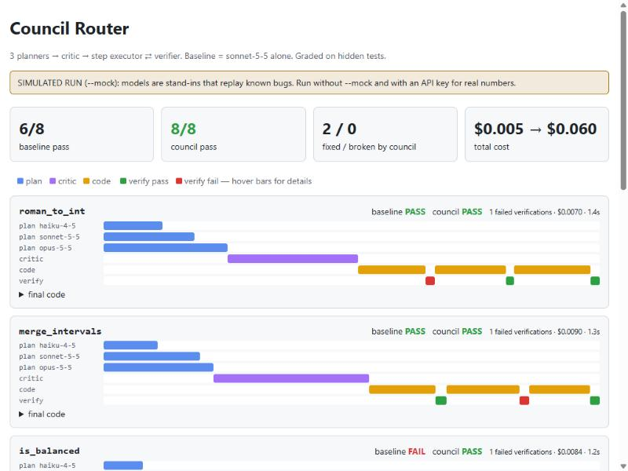
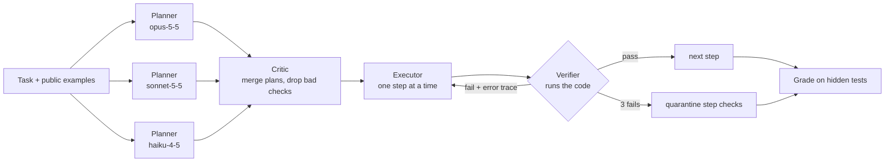

# Council Router

**Single agents fail silently. A council gets checked.**

Council Router sends a coding task through a multi-model pipeline where every step is verified by *running code*, not by asking another model if it looks right. Then it benchmarks the result against the same model working alone, on hidden tests none of the models ever see.



## The pipeline



1. **Parallel planning.** Three models of different sizes each split the task into steps. Every step comes with executable `assert` checks, including edge cases the examples don't cover.
2. **Critic merge.** The critic keeps the strongest checks, removes duplicates, and throws out checks that contradict the spec. A wrong check does more damage than a missing one.
3. **Step executor + verifier loop.** The executor builds the solution incrementally. After each step, the verifier runs the code with **all checks so far** in a fresh interpreter, so a regression in an earlier step gets caught right away. When a check fails, the exact failing assertion and exception go back to the executor for a retry.
4. **Quarantine.** Planners hallucinate too. If a step's checks fail 3 times, the router treats those checks as suspect. It keeps the new code only if it still passes everything already trusted, and moves on.
5. **Honest grading.** Final pass/fail comes from **hidden tests** that no model saw, so the council can't just overfit its own checks.

The baseline is the executor model (`sonnet-5-5`) solving the task in one shot. Both sides use the same executor, so the gap comes from the plan / critique / verify loop. That loop also draws on Opus and Haiku as planners, so it measures *council vs. lone model*, not orchestration in isolation. A same-model ablation is on the roadmap.

## Run it

```bash
pip install -r requirements.txt
python council.py --mock          # simulated models, no key, ~5s
export ANTHROPIC_API_KEY=...      # then:
python council.py                 # real Claude models
python council.py --only flatten,semver_compare
pytest -q
```

Output: a terminal scoreboard, plus `report.html` (a per-task swimlane timeline: hover any bar to see the failing assertion) and `report.json` (the full trace).

## Results

| Run | Baseline | Council | Cost |
|---|---|---|---|
| `--mock`, seeds 1–10 | 43/80 (54%) | 74/80 (93%) | ~10–12× |
| live Claude | *run it: numbers depend on the models of the day* | | |

> ⚠️ **Mock numbers are simulated.** In mock mode each model replays a known realistic bug with a set probability, and planners find the edge case with a model-dependent chance. The mock shows how the pipeline behaves. It is **not** evidence about real models. Run the live mode to get that.

## Design notes

- **Executable verification over LLM-as-judge.** The verifier is ground truth. It runs each check in its own try/except inside a fresh interpreter and reports *which* assertion failed and why, and that report becomes the retry prompt. A random completion token printed after the last check means code that calls `sys.exit(0)` early can't fake a pass. Plans are filtered to real, compilable `assert`s, because a bare `f(x) == 1` would be green without checking anything.
- **Cumulative checks.** Step *n* has to keep steps *1..n-1* green, which blocks the "fixed one thing, broke another" failure mode.
- **Graceful degradation.** If a planner's output is unusable, it gets skipped. If the critic fails, the router uses the first valid plan. With no valid plan at all, it falls back to a single step that just has to pass the public examples.
- **Cost is reported, not hidden.** The council spends roughly 10× more tokens. Whether that's worth it depends on what a wrong answer costs you.
- **Security.** The verifier executes model-written code in a subprocess with a timeout. That is **not** a sandbox, so run live mode in a container or VM.

## Layout

```
council.py        pipeline, verifier, models (Claude + Mock), HTML report, CLI
tasks.py          8 benchmark tasks: spec, public examples, hidden tests, edge case
test_council.py   task-data sanity, verifier, end-to-end mock run
docs/             sample report + screenshot
```

## Next

- `--same-model` ablation: every role on the executor model, to isolate the orchestration gain
- Add tasks from a real bug tracker (multi-file, stateful)
- Adaptive routing: skip the council when the baseline's confidence is high, to cut cost
- A Docker sandbox for the verifier
